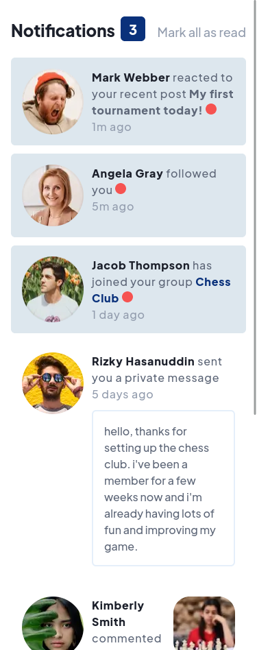
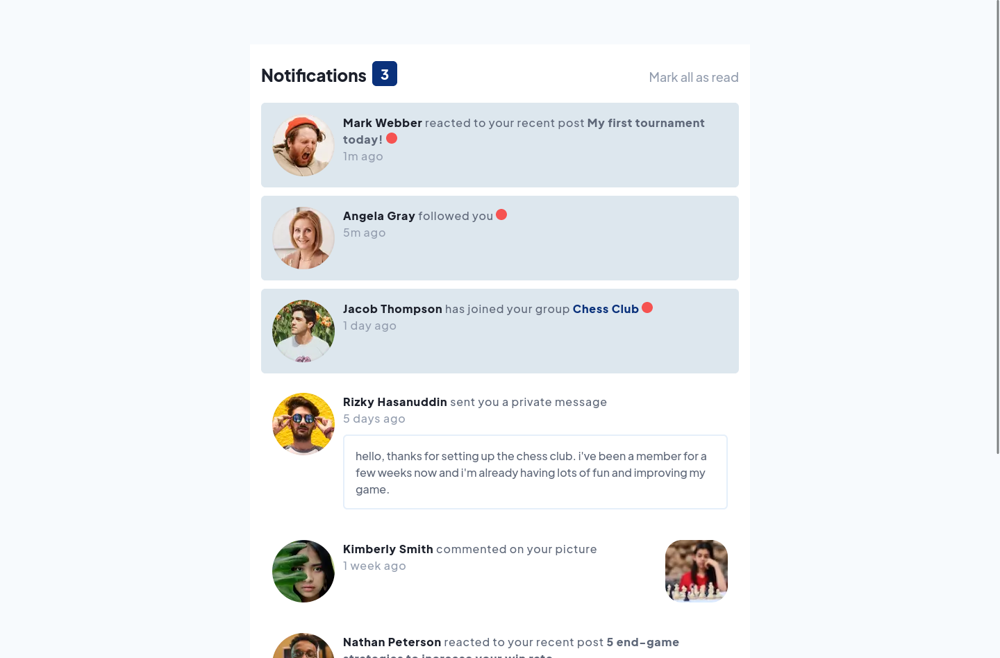

# Solución - "Nofications Page"

## Introducción

Esta es mi solución al desafío de Frontend Mentor.

## Resumen

### Desafío

El desafío consistía en que la pagína deberia verse lo más parecida posible alos diseños, aparte de ser adaptable(resposive) a los
diferentes tipos de pantalla

## Mi Proceso

### Tecnologías

- Tailwindcss
- Postcss
- Flexbox
- Enfoque "Mobile First"
- HTML

### Screenshots

375px





## Indice

- [Solución - "Nofications Page"](#solución---nofications-page)
  - [Introducción](#introducción)
  - [Resumen](#resumen)
    - [Desafío](#desafío)
  - [Mi Proceso](#mi-proceso)
    - [Tecnologías](#tecnologías)
    - [Screenshots](#screenshots)
  - [Indice](#indice)
    - [Instalación](#instalación)
    - [Autor](#autor)

### Instalación

Basta con clonar el repositorio

```text
git clone https://github.com/SaulOrlando/notifications-page.git
```

### Autor

- [Github](https://github.com/SaulOrlando)
- [Frontend Mentor](https://www.frontendmentor.io/profile/SaulOrlando)